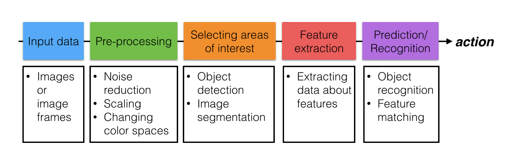

## My Learnings

This Readme contains all basic terminologies that I have come across during this lesson.

### Computer Vision Pipeline

A computer vision pipeline is a series of steps that most computer vision applications will go through. Many vision applications start off by acquiring images and data, then processing that data, performing some analysis and recognition steps, then finally performing an action. 

*Fig. 1: Computer Vision Pipeline*

### Color Spaces
Here, we will learn about popular colorspaces used in Computer Vision.
When you want to create an AI Algorithm that solves the rubix cube, you generally rely on color segmentation to find out the current state of the cube so that the algorithm can identify where to proceed further. 

Your basic dataset while training might include images of cubes taken within a room or during evenings on which the model might train well.
If you try to test this model in different lighting conditions, your model will definately fall apart in terms of solving as you do not take into account the effect of different lighting conditions.

So, in order to build robust vision applications based on color segmentatio, you will need to know something called as COLOR SPACES

Following are the different color spaces :

**The RGB color space** 
-  RGB is a color space that defines color space through the numerical values of the three primary colors: red, green, and blue. Each color has a range from 0 to 255.
-   Each color has a range from 0 to 255.
    - Red, 0-255
    - Green, 0-255
    - Blue, 0-255

- It is an **additive space** because the primary colors are combined with one another to create the non-primary colors. For example, the color “Red” is expressed as [R=255, G=0, B=0] and the color “Yellow” is expressed as [R=255, G=255, B=0]

- The three channels are correlated by the amount of light hitting the surface.

Problems with this space : 
- mixing of chrominance ( Color related information ) and luminance ( Intensity related information ) data.

**The HSV color space**

-   The HSV colour space also has 3 channels: **Hue**, **Saturation** and **Value or intensity**.
-   Hue channel represents the "colour". For example, "red" would be a colour. Light red/dark red would not be a colour.
-   Saturation channel is the "amount" of colour (this differentiates between a pale green and pure green).
-   Value or intensity is the brightness of the colour (light green or dark green).

### Some Definations 
- **Features**: A feature a measurable component of an image or object that is, ideally, unique and recognizable under varying conditions - like under varying light or camera angle
In simple terms, there are lots of measurable traits that distinguish images, and these measurable traits are referred to as features.