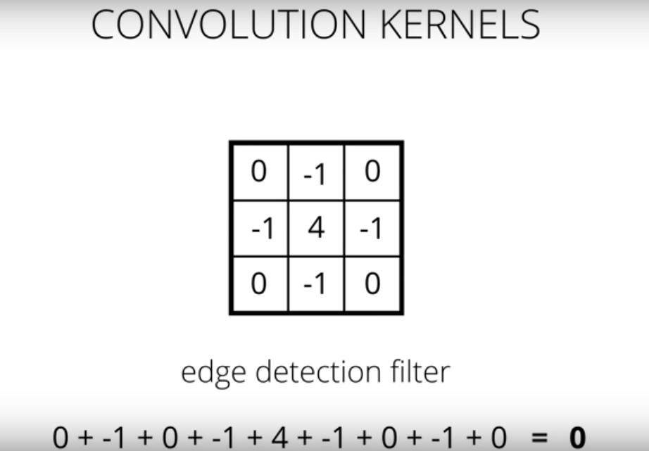
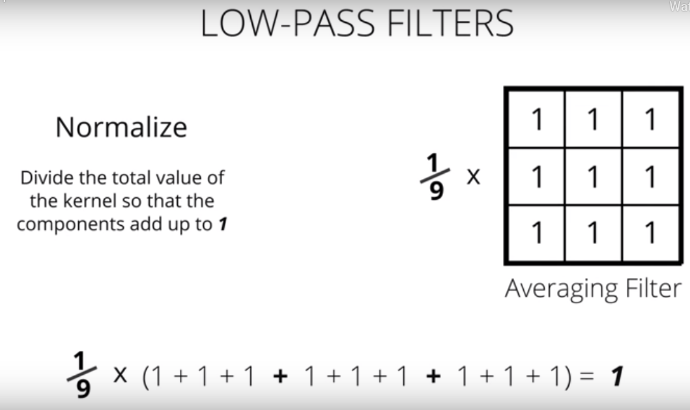
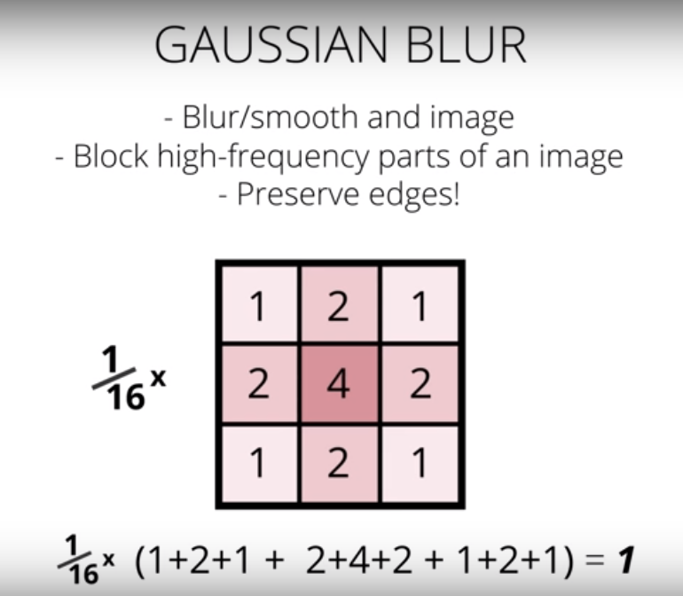
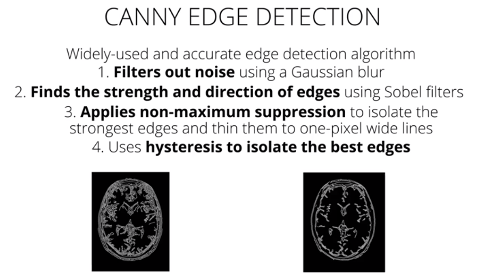

## My Learnings in this lesson

This Readme contains all basic terminologies that I have come across during this lesson.

### Frequency in terms of Images

In general, frequency is a rate of change. But, what does it means for an image to change?
-  Iimages change in space, and a **high frequency image** is one where the intensity changes a lot. And the level of brightness changes quickly from one pixel to the next.
-   A **low frequency image** may be one that is relatively uniform in brightness or changes very slowly.

__High-frequency components also correspond to the edges of objects in images, which can help us classify those objects.__

### Fourier Transform
-   The Fourier Transform (FT) is an important image processing tool which is used to decompose an image into its frequency components. 

-   The output of FT represents the image in the frequency domain, while the input image is the spatial domain (x, y) equivalent. 

-   In the frequency domain image, each point represents a particular frequency contained in the spatial domain image. So, for images with a lot of high-frequency components (edges, corners, and stripes), there will be a number of points in the frequency domain at high frequency values.

You can learn more about FT in Fourier Transform notebook.

You can also refer FT [here](https://docs.opencv.org/3.0-beta/doc/py_tutorials/py_imgproc/py_transforms/py_fourier_transform/py_fourier_transform.html).

---

### High-Pass Filters
- Sharpen an image
- Enhance High-Frequency parts of an image (e.g. edge detection).

Sum of all the values of a filter must be **zero ( 0 )** in order to correctly detect any edges.

*Fig. 1: A filter that detects edges*

---

### Low-Pass Filters
- Remove noise from an image i.e. blur/smooth an image
- Block high-frequency parts of an image

You need to normalize total value of the kernel.

*Fig. 2: A low pass filter that averages pixels*

*NOTE*: For better edge detection, first apply a low-pass filter such as gaussian filter and then apply an edge detection filter.

---

*Fig. 3: Gaussian filter-low pass filter*

---

*Fig. 4: Canny Edge Detection*

---

### Hough Transform
Hough transform transforms image data from the x-y coordinate system into Hough space, where you can easily identify simple boundaries like lines and circles. It is used in a variety of shape-recognition applications.

### Some Definitions 
- **Filters**: Image Filters are matrices that look at groups of pixels and detect big changes in intensity in an image.
    - filter out unwanted or irrelevant information from image
    - Amplify features like object boundaries or distinguishing traits

- **Intensity and Edges**: Intensity is a measure of light and dark similar to brightness. We can use this knowledge to detect other areas or objects of interest. For example, we can often identify the edges of an object by looking at an abrupt change in intensity.

### Some Useful Links
- [Medium Post on Self Driving Cars](https://towardsdatascience.com/teaching-cars-to-see-advanced-lane-detection-using-computer-vision-87a01de0424f)

- [Removing Biases in Machine Learning](https://godatadriven.com/blog/fairness-in-machine-learning-with-pytorch/)