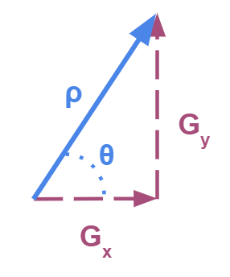
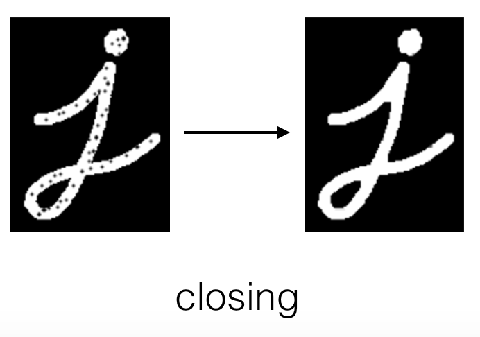
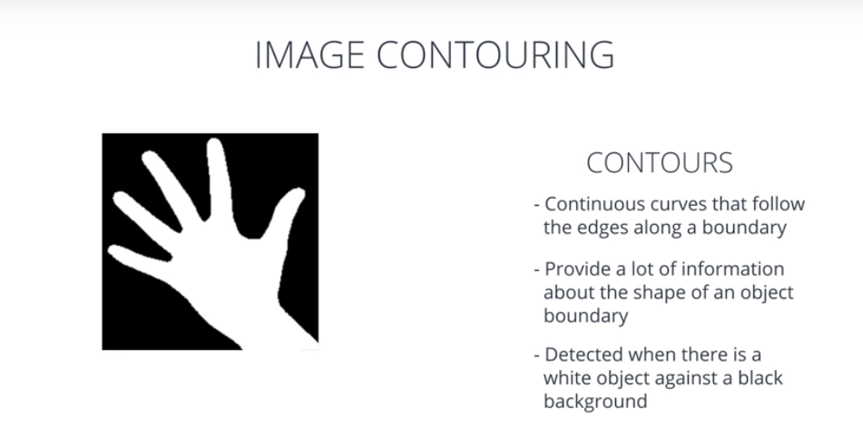

## My Learnings in this lesson

This Readme contains all basic terminologies that I have come across during this lesson.


### Keywords
    Types of Features
    Corner Detection
    Dilation, Erosion, Opening, Closing
    Image Segmentation
    Image Contours
    K-Means Clustering

### Types Of Features
- **Edges** - Previously studied
- **Blobs** - To be studied afterwards

- **Corners**

    A corner can be located by following these steps:

    - Calculate the gradient for a small window of the image, using sobel-x and sobel-y operators (without applying binary thesholding).
    Use vector addition to calculate the magnitude and direction of the total gradient from these two values.

    

    - Apply this calculation as you slide the window across the image, calculating the gradient of each window. When a big variation in the direction & magnitude of the gradient has been detected - a corner has been found!

    *HARRIS CORNER DETECTION* is being used here to detect corners.

### Dilation and Erosion
Dilation and erosion are known as **morphological operations**. They are often performed on binary images, similar to contour detection. 

**Dilation** enlarges bright, white areas in an image by adding pixels to the perceived boundaries of objects in that image. 
```python
# Explained with OPENCV code snippets

# Create a 5x5 kernel of ones
kernel = np.ones((5,5),np.uint8)

# Dilate the image
dilation = cv2.dilate(image, kernel, iterations = 1)

```

**Erosion** does the opposite: it removes pixels along object boundaries and shrinks the size of objects.
```python
# Erode the image
erosion = cv2.erode(image, kernel, iterations = 1)

```


Often these two operations are performed in sequence to enhance important object traits!

**Opening is erosion followed by dilation**. This is useful in noise reduction in which erosion first gets rid of noise (and shrinks the object) then dilation enlarges the object again, but the noise will have disappeared from the previous erosion!

```python
opening = cv2.morphologyEx(image, cv2.MORPH_OPEN, kernel)
```


**Closing** is the reverse combination of opening; it’s **dilation followed by erosion**, which is useful in closing small holes or dark areas within an object.

```python
closing = cv2.morphologyEx(image, cv2.MORPH_CLOSE, kernel)
```


### Image Segmentation
Grouping or segmenting images into distinct parts is known as image segmentation.
The simplest case for image segmentation is in background subtraction. 
A couple ways to segment an image:
- using contours to draw boundaries around different parts of an image
- clustering image data by some measure of color or texture similarity

In OpenCV Python : 
```python
# Find contours from thresholded, binary image
retval, contours, hierarchy = cv2.findContours(binary, cv2.RETR_TREE, cv2.CHAIN_APPROX_SIMPLE)
```


Some Contour Features are
- Area
- Perimeter
- Center
- Bounding Rectangle
- Orientation

### K-Means Clustering
Refer Video attached

### Some Useful Links

https://bingobaker.com/play/2907529/ec3ca64546e101ffbef492b3d10aa9d6