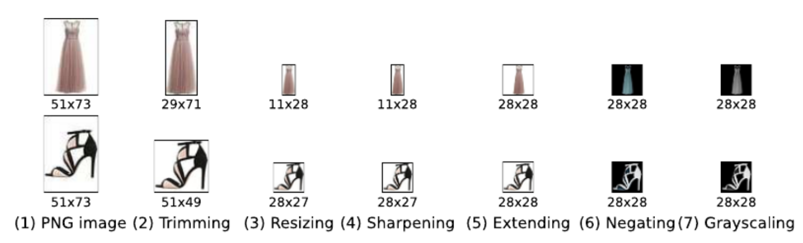

## My Learnings in this lesson

This Readme contains all basic terminologies that I have come across during this lesson.

### Keywords
    Convolution Neural Networks
    MNIST
    VGG-16

### CNN's
For filters and their uses, see the video *Convolution Layers* in the folder.

### CNN Structure
A classification CNN takes in an input image and outputs a distribution of class scores, from which we can find the most likely class for a given image.

### CNN Layers
The CNN itself is comprised of a number of layers; layers that extract features from input images, reduce the dimensionality of the input, and eventually produce class scores

### Data Preprocessing

### Some Useful Links
- [Cezannec's Blog ](https://cezannec.github.io/Convolutional_Neural_Networks/)