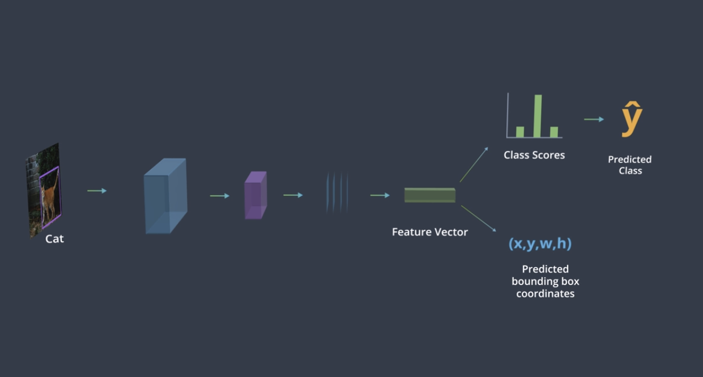
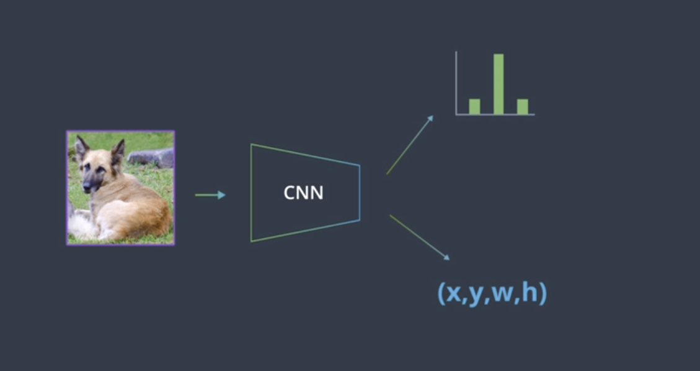
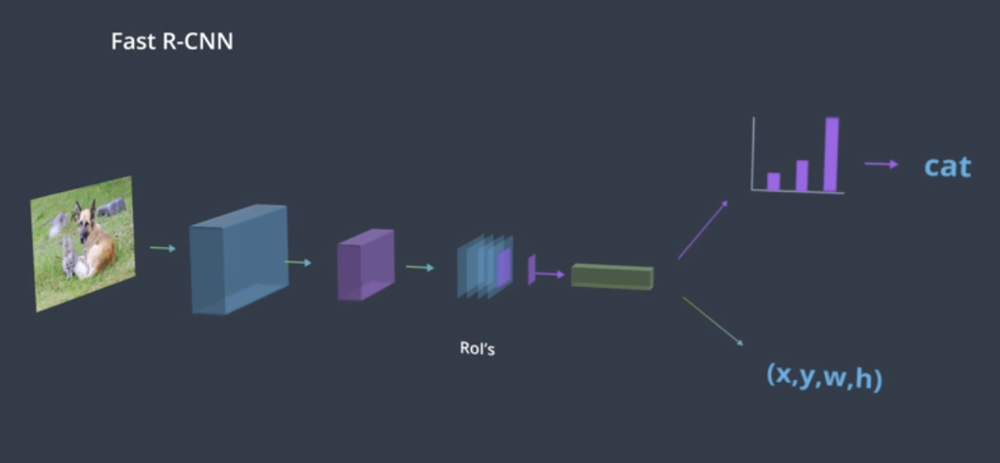
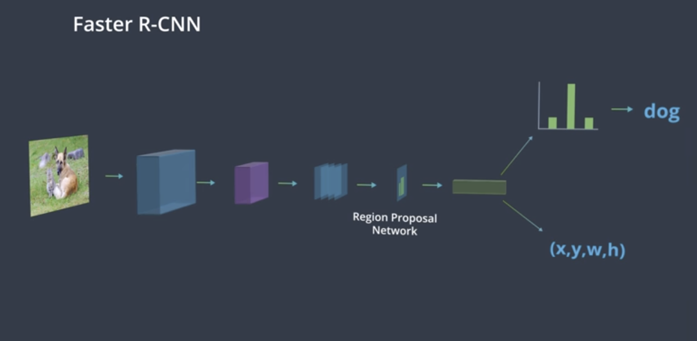

## My Learnings in this lesson

This Readme contains all basic terminologies that I have come across during this lesson.

### Keywords
    Bounding Boxes and CNN's
    Classification and Localization
    Bounding Boxes and Regression
    Region Proposals
    RCNN, Fast RCNN, Faster RCNN

### Classification and Localization
In addition to predicting whether an image belongs to a certain class or not, we sometimes have to identify whether it contains specific objects or not. Localization comes into play here. Here is an example of how the architecture will look for localization tasks

### Regression 
Like cross entropy loss function is used to calculate the loss for classification, we will need to look for different loss functions for the bounding boxes that are predicted, the ones that measure similarity between the co-ordinate values ==> A Regression problem.

Loss Functions for Regression: 

L1 Loss (Mean Absolute Error) : MAE is the sum of absolute differences between our target and predicted variables. So it measures the average magnitude of errors in a set of predictions, without considering their directions. 
**MAE loss is useful if the training data is corrupted with outliers.**

L2 Loss (Mean Squared Error) : MSE is the sum of squared distances between our target variable and predicted values.
**Used to Amplify the Outliers.**

Smooth L1 Loss : Combination of above two losses.
**MAE when 𝛿 ~ 0 and MSE when 𝛿 ~ ∞**

### Weight Loss Functions

You may be wondering: how can we train a network with two different outputs (a class and a bounding box) and different losses for those outputs?

We know that, in this case, we use categorical cross entropy to calculate the loss for our predicted and true classes, and we use a regression loss (something like smooth L1 loss) to compare predicted and true bounding boxes. But, we have to train our whole network using one loss, so how can we combine these?

There are a couple of ways to train on multiple loss functions, and in practice, we often use a **weighted sum of classification and regression losses (ex. 0.5*cross_entropy_loss + 0.5*L1_loss);** the result is a single error value with which we can do backpropagation. This does introduce a hyperparameter: the loss weights. We want to weight each loss so that these losses are balanced and combined effectively, and in research we see that another regularization term is often introduced to help decide on the weight values that best combine these losses.

### Region Proposal

*How to identify regions ?* 

The regions we want to analyze are those with complete objects in them. We want to get rid of regions that contain image background or only a portion of an object. So, two common approaches are suggested: 1. identify similar regions using feature extraction or a clustering algorithm like k-means, these methods should identify any areas of interest. 2. Add another layer to our model that performs a binary classification on these regions and labels them: object or not-object; this gives us the ability to discard any non-object regions!

#### RCNN
    1. Identify the regions in an image using standard CV techniques, also called Region Of Interest (RoI).
    2. Pass the entire vector of regions to a CNN that will be able to classify whether it is an object or a background.

An R-CNN feeds an image into a CNN with regions of interest (RoI’s) already identified. Since these RoI’s are of varying sizes, they often need to be warped to be a standard size, since CNN’s typically expect a consistent, square image size as input. After RoI's are warped, the R-CNN architecture, processes these regions one by one and, for each image, produces 1. a class label and 2. a bounding box 

#### Fast RCNN
    1. Instead of passing different RoI's through the CNN again and again, entire image is passed through CNN only once and RoI's are extracted from the feature maps.
    2. These RoI's, after resizing, are fed to fully connected layers, to predict whether the region contains object or not.

RoI Pooling : 
To warp regions of interest into a consistent size for further analysis, some networks use RoI pooling. RoI pooling is an additional layer in our network that takes in a rectangular region of any size, performs a maxpooling operation on that region in pieces such that the output is a fixed shape. Below is an example of a region with some pixel values being broken up into pieces which pooling will be applied to

#### Faster RCNN
    1. Eliminates the inference of non-object containing regions by using custom Region Proposal Network.
    2. Once RoI's are identified, same as Fast RCNN after that.

**Region Proposal Network:**

*how exactly are the RoI's generated in the region proposal portion of the Faster R-CNN architecture?*

The region proposal network (RPN) works in Faster R-CNN in a way that is similar to YOLO object detection, which you'll learn about in the next lesson. The RPN looks at the output of the last convolutional layer, a produced feature map, and takes a sliding window approach to possible-object detection. It slides a small (typically 3x3) window over the feature map, then for each window the RPN:

- Uses a set of defined anchor boxes, which are boxes of a defined aspect ratio (wide and short or tall and thin, for example) to generate multiple possible RoI's, each of these is considered a region proposal.
- For each proposal, this network produces a probability, Pc, that classifies the region as an object (or not) and a set of bounding box coordinates for that object.
- Regions with too low a probability of being an object, say Pc < 0.5, are discarded.

**Training the Region Proposal Network:**

*Since, in this case, there are no ground truth regions, how do you train the region proposal network?*

The idea is, for any region, you can check to see if it overlaps with any of the ground truth objects. That is, for a region, if we classify that region as an object or not-object, which class will it fall into? For a region proposal that does cover some portion of an object, we should say that there is a high probability that this region has an object init and that region should be kept; if the likelihood of an object being in a region is too low, that region should be discarded.

### Some Useful Links

[Medium Article on Object Detection](https://towardsdatascience.com/deep-learning-for-object-detection-a-comprehensive-review-73930816d8d9)