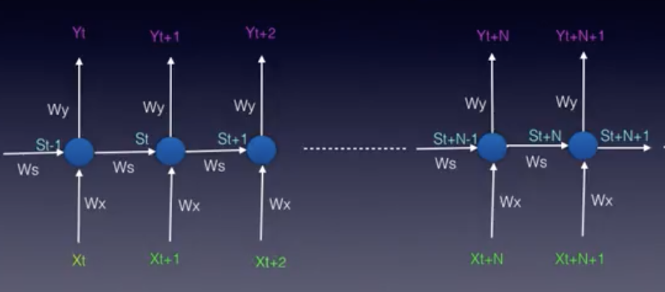
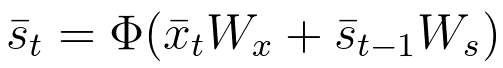

## My Learnings in this lesson

This Readme contains all basic terminologies that I have come across during this lesson.

### Keywords
    RNN's
    Backpropagation through Time

### RNN's

The neural network architectures you've seen so far were trained using the current inputs only. We did not consider previous inputs when generating the current output. In other words, our systems did not have any memory elements. 
RNNs address this very basic and important issue by using memory (i.e. past inputs to the network) when producing the current output.

Consider the unfolded model of an RNN : 

The following notation is used:

bar{x} represents the input vector, bar{y} represents the output vector and bar{s}
represents the state vector.

**Wx** is the weight matrix connecting the inputs to the state layer.

**Wy** is the weight matrix connecting the state layer to the output layer.

**Ws** represents the weight matrix connecting the state from the previous timestep to the state in the current timestep.

In RNNs the state layer depends on the current inputs, their corresponding weights, the activation function and also on the previous state:

### Backpropagation through Time - Refer Videos
- Will be updated soon..

### Some Useful Links

- [Time Delay Neural Network Wiki](https://en.wikipedia.org/wiki/Time_delay_neural_network)
- [Elman Network](http://onlinelibrary.wiley.com/doi/10.1207/s15516709cog1402_1/abstract)
- [LSTM Original Paper](http://www.bioinf.jku.at/publications/older/2604.pdf)
- [Deeplearning4j LSTM's and GRU's](https://deeplearning4j.org/lstm.html)
- [Activation Functions](https://github.com/Kulbear/deep-learning-nano-foundation/wiki/ReLU-and-Softmax-Activation-Functions)
- [Bakpropogation 1](http://blog.datumbox.com/tuning-the-learning-rate-in-gradient-descent/)
- [Backpropogation 2](http://cs231n.github.io/neural-networks-3/#loss)
- [Gradient Clipping](https://arxiv.org/abs/1211.5063)

#### Some RNN Applications
- [DOTA 2](https://blog.openai.com/dota-2/)
- [Adding Sound to Silent Movies](https://www.youtube.com/watch?time_continue=1&v=0FW99AQmMc8)
- [Automatic Handwriting Generation](http://www.cs.toronto.edu/~graves/handwriting.cgi?text=My+name+is+Luka&style=&bias=0.15&samples=3)
- [Facebook Language Models](https://code.facebook.com/posts/1827693967466780/building-an-efficient-neural-language-model-over-a-billion-words/)
- [Netflix's Recommendation](https://arxiv.org/pdf/1511.06939.pdf)