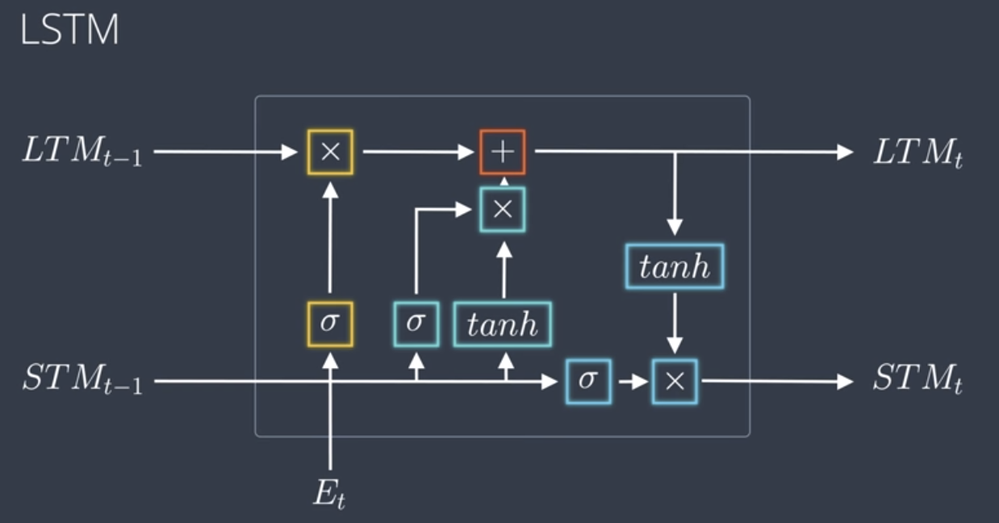
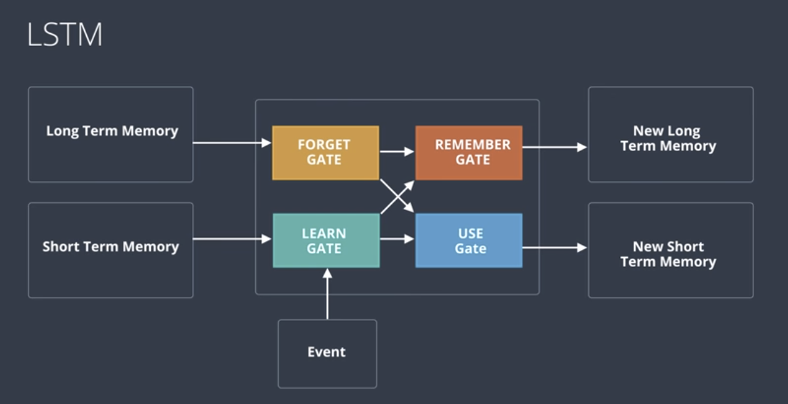
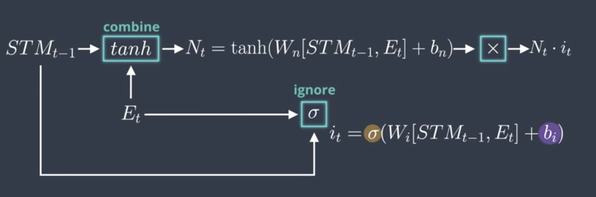
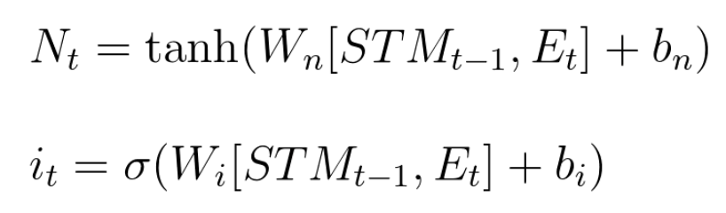
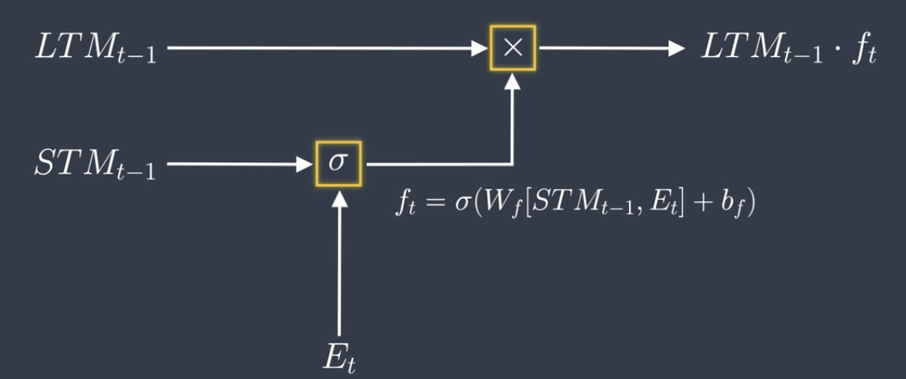
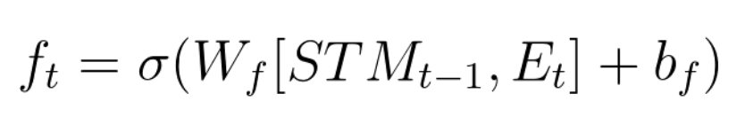
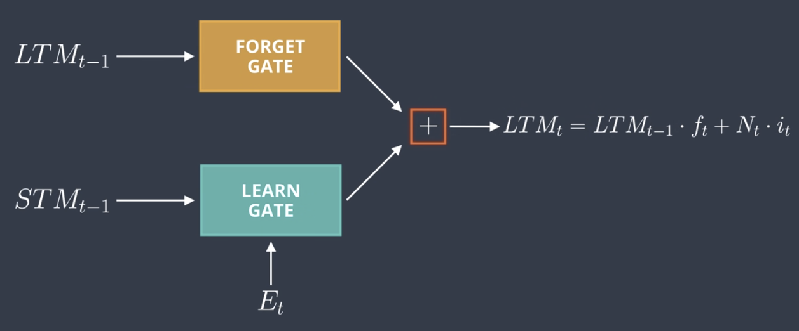
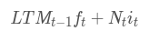
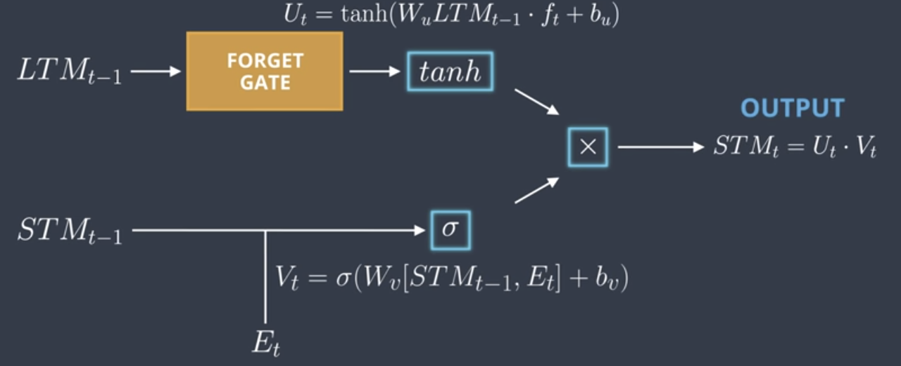
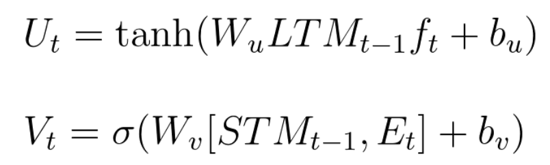

## My Learnings in this lesson

This Readme contains all basic terminologies that I have come across during this lesson.

### Keywords
    LSTM's
    LSTM Gates: Learn, Forget, Use and Remember

### LSTM

LSTM stands for Long-Short Term memory. Let's first understand the word "Long-Short"
- Long stands for the information that we want to remember for considerable amount of layers in the network.
- Short stands for the information retrieved will be remembered for next or it's next cell at max from the current cell.
- So, in every LSTM cell, what we do is take the Long term memory, take the Short term memory, perform some computations on these memories(to be discussed in a while).
- We update the Long term memory with the information extracted from the current cell which will we useful for the long term.
- We update the Short term memory with the relevant information from the current cell that will be helpful in the next cell.
- The output consists of the Long term memory, Short term memory as well as the Output of the current cell.

Here's the technical architecture:

What to learn and what to forget is co-ordinated with the help of 4 gates:

#### Learn Gate

What the learn gate does is decides what to learn in this cuurent cell from the current time input.

*How it does this ?* 

What the learn gate does is takes the Short Term memory and Current Time input and **combines** them together. From this combination, it decides what part to **ignore** using some ignore term calculated from the same Short Term memory and Current Time input. 

Here are the equations for combination and ignorance of the gate:

#### Forget Gate

What the forget gate does is decides what part of the Long Term memory to remember and what to forget. 

*How it does this ?*

Just multiply the Long Term input by the **forget factor.**
The forget factor is calculated using the Short Term input by the Current input.   

Here is the equations for forget gate:

#### Remember Gate

What the remember gate does is just combines the output of Forget Gate and Remember Gate.

*How it does this ?*

Just add the outputs of the two gates

Here is the equations for forget gate:

#### Use Gate

What the Use gate does is gives us the new Short Term memory or the output for the cell

*How it does this ?*

- Ut - Apply a **tanh** function on the output of Forget Gate.
- Vt - Apply a **sigmoid** function on the neural network of STMt-1 and Et. 

Multiply these outputs as **Ut.Vt** which forms the output of the gate.

Here is the equations for forget gate:

>Reason For using Tanh sometimes and Sigmoid sometimes: **BECAUSE IT WORKS!!** lol!

### Some Useful Links
- [Chris Olah's Blog](http://colah.github.io/posts/2015-08-Understanding-LSTMs/)
- [Edwin Chen's Post](http://blog.echen.me/2017/05/30/exploring-lstms/)
- [GRU's](http://www.cs.toronto.edu/~guerzhoy/321/lec/W09/rnn_gated.pdf)